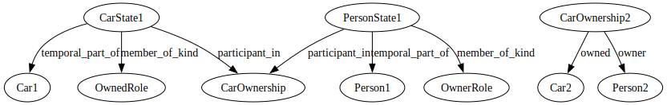
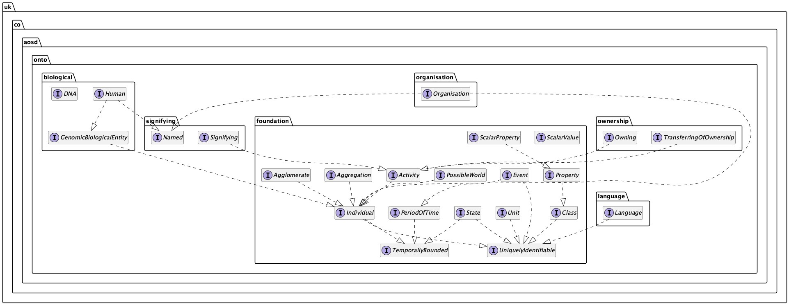

# Rethinking HQDM for Implementation
## Introduction
In this blog post, which is a follow-on from my previous blog post about HQDM, I will attempt to resolve some of the issues I raised, with the aim of producing a simplified and more understandable implementation of HQDM that is close enough to the original so as to be compatible with it. I'm going to start by removing some of the complexities of HQDM, along with an explanation of why they can be removed without loss of generality.

Once the clutter has been removed I will then try to implement HQDM as a library, which may serve as an example to help develop the MagmaCore library further using the principles demonstrated here. It may well turn out that these ideas don't work, or that they make HQDM much less expressive and therefore less widely applicable, but exploring these ideas is a worthwhile exercise and it will lead to a better understanding of HQDM and the principles of data modelling in general.
## HQDM on a Diet
Firstly, let me remove some concepts from HQDM which, if you're familiar with HQDM, may well be painful initially, but if you follow through the logic I hope you will see that the benefits outweigh the costs.
### Implementation Language
HQDM was originally defined using the EXPRESS and EXPRESS-G data modelling language, while for the MagmaCore library an informal mapping to RDF was produced. I am going to start from a programming language instead and will assume that any future serialisation format for HQDM will preserve the semantics of that programming language, which will then allow implementations in other languages to follow the same semantics in their own way. 

Candidate languages in my mind, based on languages I am familiar with, are: Java, Haskell, Rust, C++, and TypeScript, because this implementation will make use of the compile-time type checking features of the language. It will go some way towards ensuring programs create valid data models rather than relying solely on runtime type checking. Given that the [MagmaCore](https://github.com/gchq/MagmaCore) library is written in Java, I will use Java here and then move on to Haskell and TypeScript at a later date.
### No Dynamic Extensions
HQDM provides several mechanisms for extending the model, some of which duplicate existing constructs in the implementation language. For example, the use of `kinds` is the same as adding new entity types in EXPRESS, the use of the `relation` entity type is already covered by the EXPRESS language, while adding sub-types of entities is a given in EXPRESS so does not need to be modelled as a subtype of `relation`. Similarly for `classification`, `aggregation`, and `composition`. I will assume that new entity types will be added as Java interfaces at compile time rather than as runtime data, so that we can take advantage of the compiler's type-checking features.

### No Explicit Class Hierarchy
HQDM has a whole type hierarchy defining `class_of_X` for each entity type `X`, where each class is a mathematical Set, but the ability to form arbitrary sets can be more concisely captured using the Java `Set<T>` construct. This hierarchy of classes can be confusing, but when combined with the `member_of` relationship and its variants it also has the problem that the `member_of` relation itself needs to be modified to restrict the types to the correct ones for that level of the hierarchy. For example, only a `person` can be a `member_of` a `class_of_person`, so the inherited `member_of` must be overridden and redefined to capture this. With Java, a `Set<Person>` doesn't need anything overridden and fits more naturally with the idea that sets know their members, rather than each entity knowing the sets it is a member of. 

As a side note, in HQDM classes are immutable mathematical sets, so the entity type `class_of_person`, for example, represents all possible sets of `person` entities, which is an incredibly large set of sets - `class_of_person` is the power set of `person`. Furthermore, it includes all `person` entities, past, present, and future. We can't represent this in any meaningful way in computer programs so we use mutable sets and only keep track of the sets and members we're interested in, creating them as needed. In HQDM, every `thing` is a member of at least one set, i.e. the singleton set containing itself, and while this is true, there is no need to implement this in code.

### No Explicit Kinds
In HQDM, 'kinds' are an extension mechanism for adding new entity types in data. I propose that we only add entity types as new Java classes or interfaces in the type hierarchy, therefore we can exclude kinds.
### No Explicit States
This one may possibly be the hardest to swallow for some people. In HQDM, states are used to represent temporal parts of whole-life entities. For example, there is a temporal part of my car that is associated with a temporal part of me as the owner and those temporal parts began when I bought the car and end in the future when I stop owning it. The 'ownership' association is between the state of the car and a corresponding state of me as a person owning the car, and the association itself also has the same temporal extent as the state of car and state of person. States are also used to assign roles to the states (owner and owned roles) since the role is not a whole-life role of the car or person.

The need for states introduces new entity types called `state_of_X` for each concrete entity type `X` and, like `class_of_X` or `kind_of_X`, adds unnecessary complexity. I propose that states are not needed under the following conditions:

1. The temporal extent of an association is enough to identify that a whole-life object only participates in the association for the duration of the association. If necessary this temporal extent could be used to derive the state as a temporal part of the entity, but I don't believe it is necessary.
2. The role that an entity plays can be defined using more specialised relationships instead of the far too general `participant_in` relation that gives no direct indication of the role, hence the need to add it to the state. 

The diagrams below illustrate the difference, with the left side showing the states, and the right side showing the same model without states. These two diagrams are equivalent, but the right side is a simpler, more familiar, representation of the model that is easier to create and understand.

### No Associations

In HQDM there are activities and associations, which means that a participant can be a `participant_in` an association or activity, leading to use of the EXPRESS SELECT statement. Given that activities in a 4D space are effectively static structures there is very little difference between them and associations, so I propose that we remove associations and replace them with activities throughout.

I will assume that all associations can be thought of as activities, so for example, 'employment' is an activity because the employee is doing work actively for the employer. Ownership is the activity of owning, Parenthood is the activity of being a parent to a child, and so on. In this way we can remove associations and replace them with activities, thus simplifying the model further. I am prepared to reintroduce associations if there is no getting away from them.

As described in the section on states, there is no need for a generalised association or activity, therefore no need for states or explicit role entities.

### Parthood

It can be taken as a given that every entity has parts, so we don't need to model this relationship in a generalised way. Modelling parthood in a general way leads to the need to specify which entities can be parts of which other entities, using some sort of schema-like construction which then has to be checked at runtime. A better alternative is to be explicit in the model about exactly which types can have parts of which other types. For example, a broom handle, broom head, bristles, and a bracket, can be assembled into a broom in a natural way and the broom can be modelled with direct relationships to its parts rather than via a totally general part/whole relationship which is essentially devoid of much meaning. Composition is an explicit representation of the part-whole relationship between objects.

### Functional Programming Principles

I propose that we use functional programming principles to model HQDM. This means that we should be able to define everything in terms of operations that transform data structures. For example, we can define an operation that takes a person and a car and returns an ownership association, and we can define an operation that takes an ownership association and returns the person and car that are associated. We can also define operations that create, update, and delete data structures, and I believe that this will lead to a better, more composable, set of functions that will be easier to understand and reason about.

### Persistence and Model Serialisation

This experiment considers that any persistence or serialisation mechanism should be defined separately from the library, and that artefacts of the storage format should not make it into the library - this is currently a fault of the MagmaCore library (my fault actually), in that it is closely tied to the use of RDF as a storage and serialisation format. Any serialisation/deserialisation operations should be part of a separate library.

## Implementation

We can now start to implement HQDM as a library in Java, using the principles outlined above. Starting with the `foundation` package, which is important to define 'correctly' at the beginning since it will influence all other packages derived from it.

Once the foundation package has stabilised, other packages can be defined in more detail, so at least in the beginning the other packages should be considered unstable and their code exists merely to prove the foundation interfaces are viable.  Some unit tests will also be implemented to show that the foundation interfaces are viable.

The following diagram shows the package structure at the time of writing, and each of the foundation interfaces is described in more detail below:

The model is defined in terms of Java interfaces since that allows them to be added to existing code more easily, and supports differing implementations with the same underlying model. 

### Activity

An Activity is a partially ordered set of actions. This needs elaborating further, so for now it is simply a text description of the activity. Note that it doesn't have `causes` or any of the other properties of HQDM `activity` since Activity will be specialised further for each actually kind of activity and we don't need to pull up general properties into Activity at this stage. Programs and the functions within them should also be considered as activities.

### Agglomerate and Aggregation

Aggregation in HQDM has been split into Agglomerate and Aggregation:

- An Agglomerate is a set of discrete objects of potentially different kinds where each object may need to be referred to as a uniquely identifiable object. For example, a flat-pack set of parts for a piece of furniture is an Agglomerate, then once it is assembled it is a composition.
- An Aggregation represents a quantity or measure of a collection of things that don't need a unique identity, such as grains in a pile of sand or molecules in a glass of water.

### Attribute and ScalarAttribute

An Attribute is an alternative way to assign properties to an entity - Properties are modelled as a set of objects that have the same property for different periods of time, whereas an attribute applies to a single entity for a period of time. These two forms can be freely converted from one to the other and exist for programming convenience.

### Class

Class is a Set with a type and an identifier, and replaces all 'class_of_X' entity types in HQDM. In Java, 'Class<X>' is just as meaningful as `class_of_X`, which means we don't need to define the latter. This also fremoves the `member_of` relation and it's variants without loss of generality, and overcomes the need to redefine `member_of` deeper in the type hierarchy.

### Event and EventBounded

A significant occurrence or happening that marks a transition, beginning, or conclusion, often involving a change in circumstances or state. Events are used as beginning and endings for TemporallyBounded objects. Activities are bounded by Events, and Events have a TimePeriod in which they occur, which may be very small if accurately known, or large if there is uncertainty.

### Individual

An object considered as a single thing, even though it is made up of parts, e.g. a person, a car, etc., for its whole life. 

### PossibleWorld

A set of individuals considered to be a part of an actual or possible world, e.g. a plan, a story, current reality, etc..

### Property

A uniquely identifiable property of a specified type. This should not be used for scalar properties since those should always have specified units. The propery is a set of objects that have the specified property value.

### Role

Represents the role played by some entity in an activity, e.g. the role could be "Prime Minister" in a Membership entity.

### ScalarProperty and ScalarValue

A kind of property which is a scalar value with specified units.

### State

Although I argued against 'state_of_X' entity types above, I include it here to show how it can be implemented without the need to specify a hierarchy of entity types. A State is a TemporallyBounded, UniquelyIdentifiable entity referring to a particualar Individual.

### TemporallyBounded

Defines objects that have beginnings and endings in time.

### TimePeriod

There are no PointInTime objects, there are only small time periods in which events can occur. For example, a time stamp may identify a particular day, hour, minute, second, nanosecond, etc. but it will always have a duration of at that time unit, never zero duration. Developers should use appropriate time periods to represent the uncertainty about exactly when some Event occurred.

### UniquelyIdentifiable

Defines objects that have a unique identity represented by a String value which must be universally unique. UUID is ideal for this, but I use String to support other unique identifiers such as IRIs.

### Unit

Defines units of measure for ScalarValues, which ensures that the units are encoded in the type signature to prevent misusing, say, a length value in metres as a length value in feet by mistake.

### Part-Whole, Composition, and Assembly

You may notice there is no explicit mention of composition or parthood, which is deliberate since the library does not support a generalised definition beyond that already provided by Java itself. Parthood and composition are implemented as explict fields to show the structure of an entity, and it is this structure that distinguishes composition and parthood from a mere Aggregation or Agglomerate.

The example 'TriggersBroom' in the GitHub repo unit tests shows how parthood and compostion should be represented, and also shows how parts can be assembled into a composite assembly that has temporal bounds of its own, separate from the whole life temporal bounds of the individual parts. When a part is removed, the assembly ceases to exist, and when a new part is added a new assembly comes into existence.

# Conclusion

There is still a lot to be worked out for this new library, but the process of breaking down HQDM and trying to produce a more practical implementation is a useful and important one. One of the main purposes of data modelling is to allow computer software to be written in order to make use of the model, so anything that makes the job of writing code easier should be of value.

I will continue to work on the library and may well write more blog posts about it in future, but in the meantime feel free to raise issues and discussions on the associated [GitHub repo](https://github.com/twalmsley/FoundationOntology).

# Resources

- [Foundation Ontology](https://github.com/twalmsley/FoundationOntology) GitHub Repo
- [Previous Blog Post](https://twalmsley.github.io/blog1/blog1.html)
- [HQDM](https://github.com/hqdmTop/hqdmFramework) GitHub Repository
- [MagmaCore](https://github.com/gchq/MagmaCore) GitHub Repo