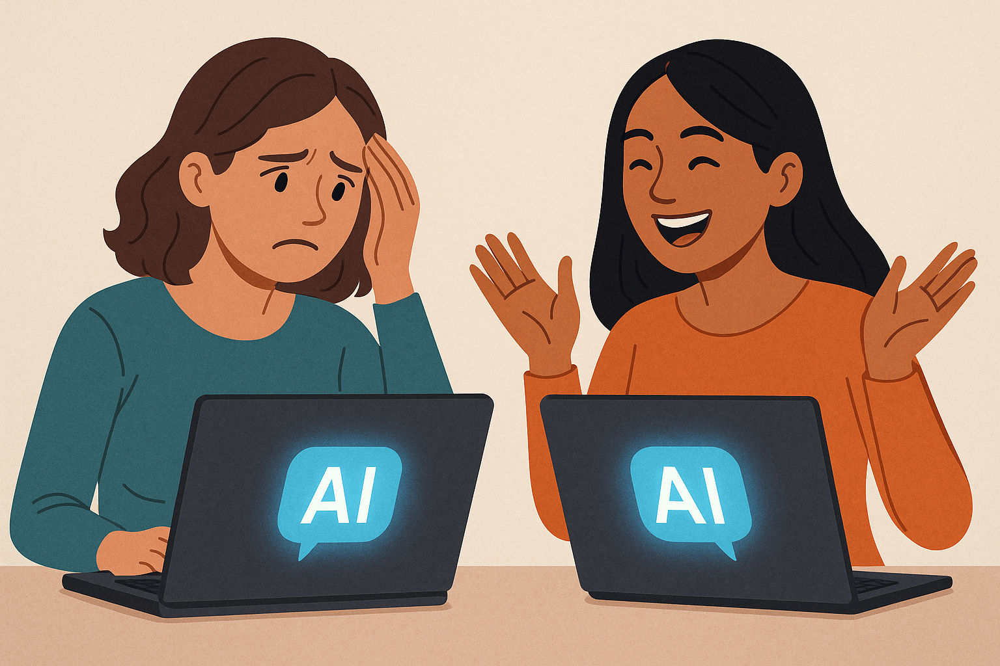

**Disclaimer**: I hate the term "Vibe Coding", but it seems to have become a synonym for coding fast and loose using AI tools. However, I do like the idea of rapid prototyping and rapid software development, so anything that can help with that sounds like a good idea to me.

**Another Disclaimer**: I wrote the whole article myself (not an em-dash in sight) with none of the text generated by an LLM so any mistakes are entirely my fault. Some of the images may well be AI generated though - see if you can guess which.

# Bottom Line Up Front

> _"AI tools will solve all your coding problems."_

> _"AI will make you redundant."_

> _"Who needs programmers any more?"_

I had fun using Cursor AI to write a couple of small web applications - there were good times and there were Death Spirals, but the overall experience was positive and I'm very optimistic about the future of AI coding tools. 

The Software Industry has changed, and is continuing to change, and I'm going to jump on and enjoy the ride.

# First Steps

## Early Success and Disillusionment

> _GitHub Copilot was interesting._

My first foray into AI coding tools was over a year ago using GitHub Copilot in my IDE to make code suggestions, which I could accept and then edit to be more like what I wanted. At first this seemed quite good and it saved me a lot of typing, but the quality of suggestions wasn't particularly high and I spent too much time re-editing the code to make it work. I was already aware of the need to read all the suggested code anyway, which was fine as it saved me a lot of typing (it's easier to type a short natural language prompt than to write the equivalent amount of code). Back then I was less experienced about how to make the best use of prompts to get the results I wanted, which I'm much better at now.

> _I preferred to do it myself._

As time went on I found it less and less useful and eventually stopped using it altogether. That was six months ago and things have moved on significantly since then so I decided to investigate Cursor AI to see what that is capable of right now.

## Cutting Through the Hype
> _"Proof that anyone can make $1,000/day"_

> _"He Earns $10K/Month Automating Directories With AI"_

When you start looking online for information about AI tools there is a huge amount of content promising instant wealth just by writing a few small webapps with AI coding tools. There is far less information about using it in real world projects in large organisations and applying it to existing code, although I do see occasional articles on LinkedIn every now and then, and I expect the frequency of use will increase. Recently I saw a job advert specifically asking for experience in AI coding tools, so I suspect this will become the norm over time.

> _Which tool to use?_

Given the confusing number of tools out there and the conflicting opinions about which one is the best, I decided just to go with Cursor AI since it seems to be one of the most established tools available, but obviously there are others. My assumption is that they will all work in pretty much the same way and use the same underlying set of Large Language Models, so the results might not be that different between them. I may be wrong of course, but I don't have the bandwidth to try them all.

# Getting Started

> _What application are you going to develop?_

Given that I've already dabbled with GitHub Copilot it didn't seem worth trying to use Cursor on an existing project, so it seems best to develop something rapidly from scratch. Actually I worked on two projects: one is a tool aimed at information requirements management, and the other is a productivity tool. The information management application would be too large and be too niche a product to develop under my own funding, so that one is parked for now, but it was a good introduction to Cursor and how to make it do my bidding. The productivity tool should be suitable for a wider audience and is small enough to fund development myself while being large enough to test the AI tools effectively. 

> _Test it in the real world._

Ultimately the goal is to publish the productivity application on the web and see how it goes. Will it survive, or will it crash and burn? Will it get hacked? Will it simply not cope with real-world use? I hope it get it out there by the end of May, all being well.

# Choosing The Tech Stack

> _Languages, Frameworks, APIs, Libraries - so much to choose from._

After solving the first problem of what application to write, the next problem is what tech stack to use. I think most people would choose something they know well, and would be disappointed with the code that the LLM generates. I would suggest using something unfamiliar so you can learn something new as you work.

Ideally the tech stack should be something I'm familiar with, but not so familiar that I'd rather just code it all myself, so I settled on the following, all of which I've used before but I'm a quite rusty on Nuxt, Vue, Tailwind, and Prisma:

- Nuxt/Vue for the web framework
- Tailwind for the UI components
- TypeScipt for the code
- Docker for containerisation
- Prisma and SQLite for a development database, targeting PostgreSQL for production
- Linux for the development machine

The aim is to get Cursor AI to do as much of the coding as possible because that will be the best way to find its limitations. 

# Coding with Cursor AI

Before running Cursor, I did use the nuxt command line to initialise a "hello world" project just to get off the ground, then I ran the server in development mode and opened the project directory in the IDE.

## How is the Experience?

> _Pleasure and pain._

It took me a while to work out the level of granularity of what to ask for in the AI Agent dialog box and initially I was micromanaging it, telling it every little change I wanted, but I quickly learned to ask for things in higher level terms so that it could make wider ranging changes to the code. It is possible to generate a well designed static web site with a single prompt, which appears in your browser like magic, but then you need to get down to the detail of adding more functional features including the basic login/logout, user registration, and storing things in a database, etc.. 

> _It's only human._

Sometimes adding features was a breeze, other times it took quite a few prompt revisions and retries to get the result I wanted, but also occasionally there were complete Death Spirals where no matter how I changed the prompts the tool was simply tying itself in knots writing and rewriting code and making the same mistakes over and over again. I can sympathise because I've been there myself sometimes over the years! The only solution to a Death Spiral is to rollback the changes and start again, which is also something I've had to do myself from time to time. So far I'e managed to get what I want in the end with minimal tweaks, but it is useful to follow the same process for each change you want to make, and that is the subject of the next section.

## What process to follow

> _Order out of chaos._

Like humans, LLMs make mistakes and some LLMs are better than others at writing code, so with that in mind we can develop a process that reduces the chances of mistakes making it into production in much the same way as in a normal development project:

1. Pick your team
1. Pick a feature to work on
1. Prompt the agent
1. Review the changes
1. Test the changes
1. Accept the changes
1. Commit the changes
1. Repeat with a clean conversation

### Pick Your Team

> _It's a partnership._

Think of yourself now as being in a pair programming team, you and the AI, so you'll need to pick your partner from the supported model options. You can choose auto LLM selection to get the fastest responses, but this is the equivalent of your pair programming partner being replace with someone else mid feature and you won't get the same results from one feature to the next. I do wonder whether this is the cause of some of the Death Spirals I've encountered. Having tried a few different models I eventually settled on 'claude-3.7-sonnet' as the best one for me because the others don't seem to work as well, but this model can get overloaded by other users so sometimes I drop down to 'claude-3.5-sonnet' and take my chances.

I find it helps to think of the LLM as a fairly experienced programmer who can type very fast but who sometimes cuts corners, misunderstands what you mean, or simply forgets what it's doing part way through a task. Don't be too hard on the LLM, it's only human.

### Pick a Feature

> _Features maketh the application._

It is possible to give the agent a one-line description of a feature and just let it rip, but then you're taking pot luck that the agent can guess what you really want - sometimes it works and sometimes it doesn't. 

I've found the best way is to write a paragraph describing the feature and how it should behave, ideally in a separate area. One option that worked well was to write GitHub issues with the feature description, and ask the agent simply to "use github cli to read issue X and implement it". If you try to write the description directly in the agent text box it's too tempting to hit the enter button too soon before you have a proper description of the feature.

Once you have the feature description tied down you can move on to the next step, but first make sure there are no outstanding changes to commit and be sure to start with a new agent conversation.

### Prompt the Agent

> _Let it rip._

Now the fun begins, especially if you're working with something that supports hot reloading. Enter the prompt and sit back and watch the magic happen. You may see the agent backtrack and re-implement something, but you should see the changes take effect and see changed files appearing in the Git tab (sometimes you have to refresh it manually) until it completes the task you gave it - if it's still working you'll see the "Generating..." text in the agent. With luck you'll now have a fully implemented feature, but you may have to iterate to get it complete.

### Review the Changes

> _Trust but verify._

The next place to look is the Git tab where you should read through all the changes made to make sure they're sensible. If you're impatient like me sometimes you will skip this in your excitement to see it working, but you really must do this before committing anything to Git!

### Test the Changes

> _Double check._

If you have hot reloading then great, test the new feature, but if it doesn't work you'll need to ask the agent to make addition changes. If there are errors you can copy the error to the agent and say "fix this", because it's quite good at working out what went wrong.

I also recommend testing any functionality related to the files changed, because it can break existing features just like a human can.

### Accept the Changes

> _Looks good._

Usually the agent will ask you to accept or reject the changes from the recent prompts, so accept them if they look good or reject and try again if not. This doesn't commit the changes to Git so you'll do that next.

### Commit the Changes

> _Bite the bullet._

Since you didn't review the changes when I told you to you'll really have to do that now. Just because the feature works doesn't mean the code is correct. If you're happy then go ahead and commit - you can get the AI to generate the commit text as well if you prefer. You can just rollback the changes if they're not up to scratch and try again with a clean agent conversation.

### Start a Clean Prompt

> _Make coffee, add feature, repeat._

It seems like a good idea to start with a clean prompt at least for each feature, and maybe more often than that, because the context window can get cluttered with irrelevant junk that confuses the LLM and may take you into a Death Spiral.

---

## What are the benefits?

> _Like most things in life AI coding tools aren't perfect, but they are useful, so here is a breakdown of some of the benefits I've found:_

1. **Speed** - it can generate a lot of code for a relatively small prompt. This can make you a lot more productive, especially for the simpler tasks, which leaves more time to fix problems or work on the more difficult features.
1. **Speed** - again? Yes. You can iterate faster which reduces the cost of just trying something out and then abandoning it. If you don't really know how you want a feature to work you can create something simple and iterate from there. Possibly even roll it back completely and start again relatively quickly.
1. **Speed!** - I've been able to produce two non-trivial prototypes in the space of 6 working days, one of which is suitable as an MVP for public beta testing - more on that in another blog post.
1. **Higher Level Focus** - you can think more about the features rather than about the detail of a piece of code, so you can think more strategically about your application.
1. **Learning** - if you can code in one language you can usually read others fairly easily and make manual changes even though you're not an expert. Seeing how the LLM implements features, uses the language, and uses the frameworks, will mean you learn about them too as you go, and you can use languages and frameworks that you have no experience of.
1. **Quality of Life** - as a developer I can sometimes feel bogged down in the weeds of the code, but with the AI tools I feel more productive and more business focussed (at least as long as I'm not in one of the Death Spirals).
1. **Cost** - your pair programming partner is cheaper than hiring someone else.

## What are the problems?

> _Now for the problems, which aren't trivial and shouldn't be overlooked if we're still cutting through the hype:_

1. **Cost** - yes we had this before, but each AI request uses up credit that is included in your subscription so you may have to upgrade your plan or pay for additional usage at some point. There's no such thing as a free lunch.
1. **Death Spirals** - it was tempting to list this one first. They're frustrating but you can get out of them quicker than you can compared to one of your own Death Spirals because you've put less effort into them and are less invested in them. Once you recognise the Death Spiral, climb out.
1. **Quality** - this might be a killer for some types of project. I can't vouch for the production quality of the code, but I have seem code duplication, poor code choices, and other problems that you could pick up in reviews and will have to change manually. If you follow a decent development process you will find any issues, but then you will need to ask yourself whether you're really saving very much by using AI.
1. **Limited Credits** - My subscription has 500 fast credits per month, which means that once they're used up I will have unlimited slow credits for the rest of the month. Slow credits are for smaller, slower LLMs so I expect my productivity will nosedive when that happens. I'm getting close to that so I'll cover it in the next blog. In the meantime I will have to be more careful about how I use the credits, and there are a few things that will help with this, such as not asking the AI to make trivial changes when a manual change is quicker and easier, and using longer prompts that clearly tell the AI what I want which _should_ reduce iteration and therefore save credits.

## How it has changed my approach

It's early days but I have definitely noticed a change in my approach to software development. For most of my career I've been more interested in the code than the actual application. I spent 2 months this year studying code proof using Agda, and it was hard work but good fun. I used to love the level of control I had and there is true joy in writing clean, well-structured, high quality code that solves a real world problem. Having said that I'm sure that a lot of my code wasn't as robust as it could have been even though that was the goal.

This has changed the way I look at software development now, and I find myself more concerned with the business aspects of the application rather than the detail of the code. This transformation has only taken about 10 days, and I'm not sure whether its the AI tools that are the cause or whether it's merely the fact that I'm trusting the coding to "someone else". 

## ⚠️ Caution ⚠️

> _"Vibe coding app hacked on day one."_

> _"Someone used all my ChatGPT API credit."_

You don't have to search very far to discover some horror stories about AI-written applications that have gone badly wrong, so here are a few pitfalls to avoid. I hope I manage to cover these in my current web app.

### Check security

This is a potentially a big problem. I have seen the AI generate API services without adding security checks for a logged-in user, so some API calls will be unsecured. You will need to review the code and make sure everything that needs to be secured it secured. Adding CORS will help, but again you will need to ask the AI to set this up explicitly.

### Check efficiency

As already mentioned, the code isn't always the most efficient so you will need to optimise and reduce code duplication manually. For example, in my productivity application there is a paginated task list but the pagination is all in the browser, which will need refactoring to support paginated database queries at some point.

### Don't checkin any files containing passwords or API keys

This isn't just a problem with AI coding tools, it's one the people do by mistake as well. You should be especially careful with AI coding to make sure every commit has been checked for passwords and API keys, otherwise this could be a costly mistake.

### Needs experienced developers

Some of the problems you hear about are due to inexperienced coders jumping on the AI bandwagon with the aim of making a fast buck. Experienced developers can greatly improve their productivity by using these tools as part of a robust development process, while inexperienced developers will miss some important considerations.

# Job Replacement or Enhancement?

> _The New World Order._

In my opinion, from my limited experimentation with these tools, I believe that AI-enhanced coding will boost productivity of experienced developers, but not yet replace them. In the future I expect my job to be less about typing code and more about typing prompts, and then using my experience and detailed knowledge to find and fix problems. 

As newer developers get used to these tools I expect that most of them will have less interest in the details of coding, and they may depend on more experienced developers to help them fix problems. Perhaps older developers like me will be working mainly on legacy code and maintaining or debugging AI-generated code as their main occupation, then as we retire that role will be taken over by improved AI tools that can do the debugging for us. There will always be people who prefer not to use such tools so I doubt we will ever lose the skills completely, but the pool of these kinds of developers will become smaller and more specialised.

It will be a long time before AI can replace all humans in software development activities, and over the coming months and years it will gradually make its way into mainstream software development teams. Personally I'm very keen on seeing this happen and I'm embracing the AI revolution - I believe we can do great things with these new technologies, and not just use them to make pictures of ourselves as vacuum packed plastic action figures.

# What is coming?

> _The future is bright._

For my own productivity application I will finalise the main features using AI as much as possible and then get it out there on the internet where it will be free to fly, or free to crash and burn. The development process will change as my Cursor credits run out and I have to rely on less capable LLMs.

What about the future of AI coding, what is coming next? 

1. **Better LLMs.** Improvements in LLMs, or perhaps other kinds of models, will get better at interpreting the prompts and will generate better code. They will have larger context windows and will make fewer mistakes.
1. **Debugging and Optimisation.** The tools will produce code with fewer bugs that is more efficient, but will also be able to debug and optimise code much better than they do at present.
1. **AI Testing.** The tools will be able to generate comprehensive tests and use them to make sure everything still works after changes to the codebase. Regression tests, boundary value tests, system tests will all be generated by AI.

# Progress and the next Blog Post

> _Back to business._

My productivity app has the initial features that I want to have when it goes live, and my next steps will be to productionise it, so there will be quite a few manual revisions to the text content as well as some technical improvements. 

 I will cover this in the next blog post and I'll also give details on whether or not it went well. I'll cover how the coding process changes when I run out of Cursor "fast" credits and have to rely on the "slow" credits, and if I get to publish the productivity application I'll be able to tell you whether it has survived and what feedback there is, if any.