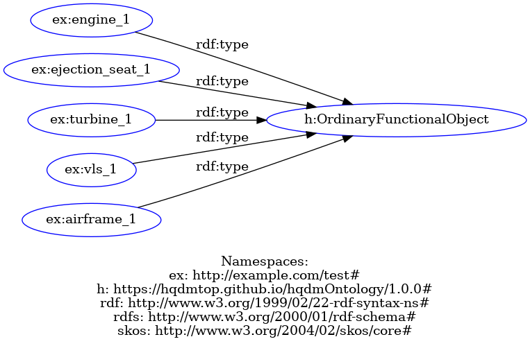

# HQDM Systems F-35 Example

This document contains an example related to HQDM (High Quality Data Model) systems using F-35 fighter jet components. This is, of course, a contrived example and a real-world version would be much more detailed.

## Overview

The example scenario is taken from the code in my fork of the MagmaCore library [here](https://github.com/twalmsley/MagmaCore). The code creates two Functional Systems, one representing an aircraft as a system, and one representing an engine as a system. It then installs an engine in both systems. The data is stored in an Apache Jena database and exported as RDF for visualisation using [RDF-Grapher](https://www.ldf.fi/service/rdf-grapher).

Each of the two systems represents a particular physical object, with the first representing a specific individual F35 aircraft, and the second a specific individual F135 engine. The engine system can be referred to independently of the aircraft whether or not it is installed in an aircraft.

Additionally, there are Ordinary Functional Objects that can be installed in the systems at various times.

So when an actual engine is installed in an engine system, and the engine system is installed in the aircraft, the two system components representing the engine, and the engine itself, all occupy the same spatio-temporal extent and are therefore identical. 

## Systems and Components Overview

The following diagram represent a view of a specific F35 aircraft with made-up tail number 2101, and its components.

The next diagram shows the F135 engine system and its components.

Next we have the Ordinary Functional Objects that can be installed in the systems. These are likely to be instances of more specific types than direct instances of Ordinary Functional Object (as they are in the actual code), but this is fine for the example.

## Representing Installed Parts

Installing a part involves creating an object which is an Installed Functional System Component, and which is also a state of both the System Component it is installed as, _and_ the Ordinary Functional Object which is installed. The Installed Functional System Component is a _temporalPartOf_ the System Component and the Ordinary Functional Object.

The next two diagrams should illustrate the situation more clearly, click the links to see the full-size images.

This diagram shows an engine installed in an engine system: `ex:99` is the installed engine and, as you can see, it is an Installed Functional System Component and is a `temporalPartOf` the System Component and the Ordinary Functional Object. Not shown is that it is also a state of both the System Component and the Ordinary Functional Object.

[Installed Engine in Aircraft](installed-engine-in-aircraft.png)

Similarly, the engine can be recorded as being installed in the aircraft:

[Installed Engine in Engine System](installed-engine-in-engine-system.png)

Importanly, using systems and system components allows us to refer to 'the engine in F35 aircraft 2101' regardless of which _actual_ engine is installed there. We can also refer to the `F135 System 1001` turbine, regardles of which actual turbine is currently installed. 

## Adding the Other Components

Extending the model to include the other installed components for both the aircraft and the engine systems results in quite a large model for such a small example. The corresponding code for the domain model extension is also quite large due to the need for new types for everything. In practice, with millions of parts, it is more likely that dymanic types will be used, rather than Java classes. 

[F-35 System Components](f35-system-components.png)

## Intended Roles

Each of the types in the example will all have `intendedRole` predicates, possibly multiple, and when installing a part as a component, the `intendedRole` must match the target, or at least one of the `intendedRoles`. In this way it should be possible to model the fact that an aircraft can have one of several types of engine installed, as long as the engine's `intendedRole` matches one of the aircraft's supported `intendedRoles`

## Further Information

(Some of these links might need you to be logged in to GitHub)

- [HQDM Online](https://hqdmtop.github.io/hqdmFramework/hqdm_framework/hqdm_framework.htm#entities)
- [HQDM RDF](https://github.com/hqdmTop/hqdmOntology/blob/main/src/ontology/hqdm.ttl)
- [Full RDF for this example](rdf.ttl)
- [MagmaCore F35 Model Extension](https://github.com/twalmsley/MagmaCore/tree/main/model-extension-f35)
- [MagmaCore F35 Example Usage](https://github.com/twalmsley/MagmaCore/blob/main/examples/src/main/java/uk/gov/gchq/magmacore/examples/extensions/F35ModelExtensionTest.java)