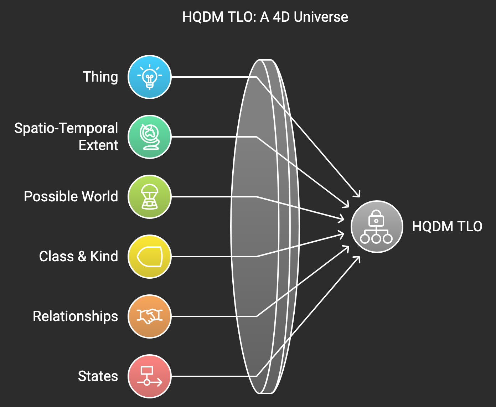
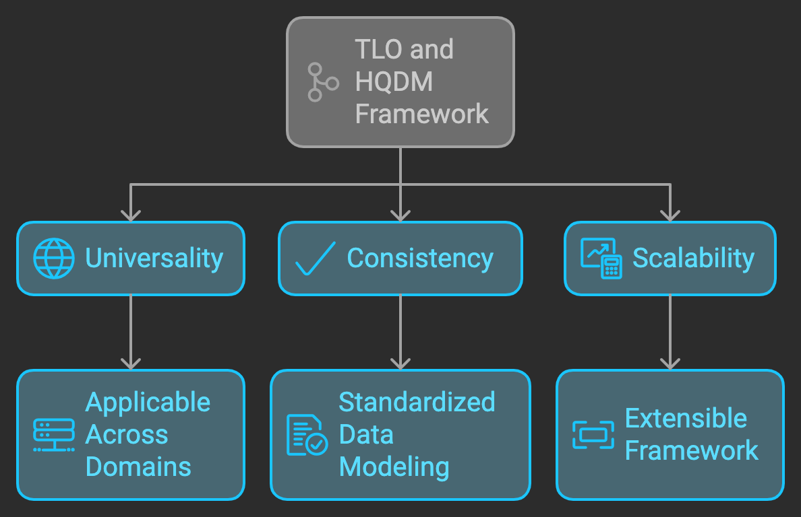
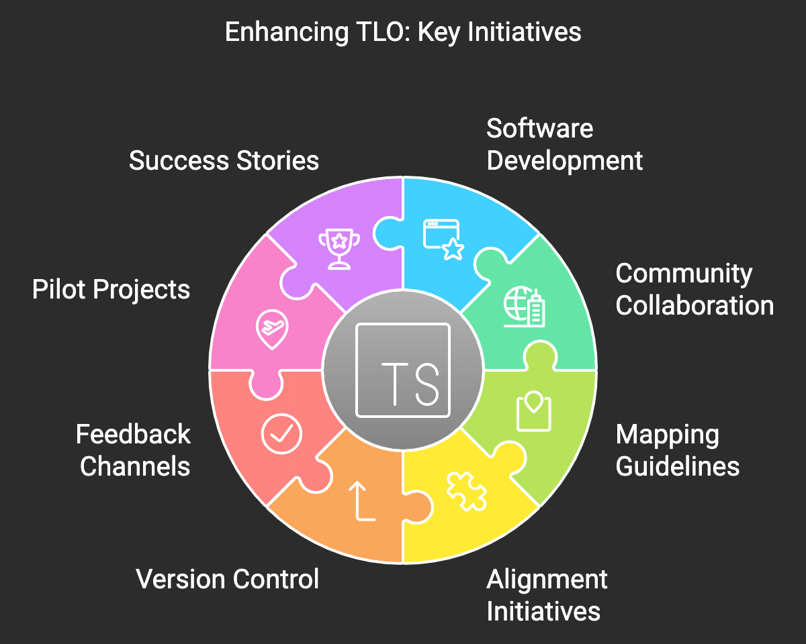

# Introduction

This blog post explores the book *Developing High-Quality Data Models* (often referred to as *High-Quality Data Modelling* and abbreviated to HQDM), authored by Dr Matthew West OBE and published in 2011. The book is the culmination of over twenty years of Matthew's efforts to solve data sharing and integration problems, primarily within the oil and gas industry. Informed by his work on ISO 15926, the book addresses areas of the standard he felt were lacking. Matthew also credits [Chris Partridge](https://borosolutions.net/who-we-are) of BORO Solutions for the foundational idea of assuming a 4D model of the universe.

This blog is not merely a book review; it is structured into four main sections:

1. Information about Matthew, the motivations behind the book, and how to acquire a copy.
2. A review of the book's structure and content.
3. A discussion of the Top-Level Ontology (TLO) described by Matthew.
4. A critical analysis of the TLO and potential issues arising from practical experience in using the model and implementing it in code.

The fourth section is the most extensive, reflecting my more significant experience in that area. I leave a detailed review of the rest of the book to others.

# About The Author

Dr Matthew West OBE, who sadly passed away in mid-2023, was a leading figure in data modelling. I believe he would have welcomed the opportunity to discuss some of the issues I raise in the experiences section below. More information about Dr West can be found [on his website](https://www.matthew-west.org.uk/), which offers insight into his professional work and personal interests. One aphorism from the site that resonates with me is: *"Don't let your principles prevent you from doing what's right."* It's important to note that Matthew never intended for HQDM to be implemented in code, and many of the criticisms in the experiences section stem from attempts to do so. Therefore, I believe HQDM itself is sound, and most of the issues I describe arise in the implementations.

The book is available on [Amazon](https://www.amazon.co.uk/Developing-High-Quality-Data-Models/dp/0123751063/) and [Elsevier](https://shop.elsevier.com/books/developing-high-quality-data-models/west/978-0-12-375106-5). I highly recommend purchasing a copy and studying it thoroughly because a simple read-through is insufficient to grasp Matthew's ideas fully. Despite its readability, the book is surprisingly dense with information. There is a [web-browsable version of the data model presented in the book](https://hqdmtop.github.io/hqdmFramework/) that provides a flavour of what to expect, but to understand it completely, reading the book is essential.

In the preface, Matthew gives a full account of how and why he came to write the book. In brief, while working at Shell and observing recurring data integration problems across different business areas, he developed a strong interest in data modelling. He spent many years working to resolve these issues, along with many colleagues who he rightly credits in the book. Ultimately, the book distils his varied experiences over the course of his career and provides a clear and concise account of the need for consistent data models for data sharing and integration.

# Structure of the Book

The book consists of four main parts:

## Part 1: Motivations and Notations

Part 1 comprises five chapters discussing the need for data models and the various types of model required. It explores why multiple models are sometimes necessary to represent different aspects of a system. Matthew introduces the EXPRESS-G notation as a method for presenting data models and discusses the role of models in describing Enterprise Architecture. He concludes by addressing the need for data modelling standards and the challenges involved in perfecting these models.

## Part 2: General Principles for Data Models

In Part 2, Matthew offers a practical discussion of basic modelling principles for attributes, relationships, and entity types. He includes examples to illustrate common modelling errors that must be avoided to ensure the model's accuracy and durability.

## Part 3: An Ontological Framework for Consistent Data Models

From my perspective as a software developer, Parts 3 and 4 are the most interesting. Part 3 introduces a set of ontological commitments underpinning the entire HQDM model from this point forward. It includes chapters on spatio-temporal extents and classes — two of the most fundamental concepts in the 4D representation of the world described by this Top-Level Ontology. Subsequent chapters delve into less abstract concepts that are generally applicable across various modelling domains. In particular, the use of States, Events, Activities, and Associations are detailed, as they are the primary mechanisms for recording a model's evolution over time. It is these entity types that enable a 4D representation of reality.

## Part 4: The HQDM Framework Schema

Part 4 describes the Top-Level Ontology in detail, starting with the highest level, most fundamental entity types, and progressing into more specific types that Matthew found most useful from his experience. Many of these entity types are suitable for a wide range of applications. In my experience, there are enough entity types to handle most applications without needing to extend the model, although it may require using a more general entity type than preferred. Not all entity types should be considered 'core' types, as quite a few are superfluous for some applications.

# The Top-Level Ontology (TLO)

Having covered the book's overall structure, I will delve deeper into what I consider the essence of the book: the TLO. This part has occupied my work for the last six years or so. Most of my work has involved developing the [MagmaCore](https://github.com/gchq/MagmaCore) framework (along with others) in Java to implement HQDM, the TLO, and some applications that use it. MagmaCore might be the subject of another blog post, but using it has informed the rest of this review of the TLO, and it would not have been possible for me to understand HQDM without actually applying it in non-trivial applications.

As you read the HQDM book, the necessity for a common understanding of what exists in the world becomes apparent. Matthew presents his view — his ontology — and acknowledges that others might not necessarily agree but asks readers to accept it for the purpose of understanding the model he presents. Other ontologies may be equally valid, but differences can cause problems in exchanging information, requiring more effort to overcome those incompatibilities. The HQDM ontology — the TLO — is proposed as a unifying model for understanding the world, with the conjecture that if systems are developed using the same TLO as a guide, it will be easier to integrate and exchange data between them. The TLO ensures that applications use the same fundamental entity types and concepts, thus reducing the effort needed to export data from one system and import it into another. The point is not that it becomes effortless, but it should become significantly easier. Taken to the extreme, if systems use the same TLO implementation and type of database, data sharing and integration become even more straightforward.

As mentioned earlier, Matthew didn't intend for HQDM to be implemented in code. However, given the specification of the entity types in EXPRESS, it seemed worthwhile to attempt it. Along with others, I developed the MagmaCore Java implementation of HQDM and improved it over subsequent years. As soon as I started writing the code, it became apparent that producing a strict implementation of HQDM wouldn't be easy — partly due to the structure of HQDM itself but also because some constructs used in EXPRESS are unavailable in Java. I will leave the details for another article on MagmaCore, other than to say that I tried several different implementations in Java, Haskell, and TypeScript without producing something I am entirely satisfied with.

Next, I turn to the most important entity types in the TLO.

## Thing

'Thing' is the ultimate supertype of all entity types in HQDM and represents pure existence — everything real or imagined is a thing.

## Spatio-Temporal Extent

A 'spatio_temporal_extent' is an arbitrary region of space-time, which may or may not coincide with any particular object. It could simply be a portion of space-time containing nothing at all and may also be discontinuous. All objects that exist in space-time are subtypes of spatio_temporal_extent, and this entity type expresses the 4D nature of the HQDM TLO.

## Possible World

The 'possible_world' entity type allows for modelling alternate realities, such as future plans, alternative histories, fantasy worlds, or uncertain futures dependent on currently unknown information. All spatio_temporal_extents are part of at least one possible_world.

## Class and Kind

Classes and kinds are both 'sets' of things (sets in the mathematical sense). A class is an arbitrary collection of (possibly disparate) things, while a kind is a set of all things of a particular type. For example, a specific group of 'person' entities present in a room could be represented by a 'class_of_person', whereas a 'kind' containing all possible persons is essentially the same as the entity type 'person', since they both have the same membership. Kinds are intended for use in extending the model without sub-typing, as they can be created on the fly, whereas sub-typing requires a more explicit definition of a new entity type within the HQDM model.

## Relationships

The EXPRESS language and EXPRESS-G notation allow the introduction of new relationships whenever needed, as they are fundamental to data modelling and included in the definition of the modelling language. However, HQDM also defines a 'relationship' entity type with subtypes representing concepts such as aggregation, composition, and classification, which are equivalent to their counterparts defined directly in EXPRESS-G notation. Representing relationships in this manner seems intended to support creating new relationship types on the fly without extending the model using EXPRESS, similar to adding 'kinds' instead of extending the model with new entity types.

## States

States are extensively used to represent temporal parts of spatio-temporal extents and can represent temporary relationships between things. For example, a person doesn't own a car forever but only for a specific time period. Therefore, the relationship is actually between a 'state_of_person' and a 'state_of_car' for the duration of the ownership, and the 'person' and the 'car' continue to exist both before and after the ownership. This approach simplifies modelling multiple overlapping ownerships of different cars, as well as instances where the same person owns the same car during multiple distinct time periods. States are essential for representing the 4D aspects of the world in HQDM.

# Strengths

Before delving into my experiences using HQDM, it's worth highlighting some of its strengths:

- **Universality:** By focusing on high-level concepts, the TLO is applicable across multiple domains, promoting interoperability. The HQDM framework aims to model anything and everything, and so far, I haven't encountered an area it can't handle, although some creative thinking is sometimes required.

- **Consistency:** Provides a standardised approach to data modelling, reducing ambiguity. Data models developed from the same underlying ontology are far more likely to have fewer problems when sharing data, and less effort will be needed to develop the necessary import/export functions.

- **Scalability:** Offers a scalable framework that can be extended to accommodate more specific concepts as needed. It's possible to extend HQDM using new entity types and adding relationships using EXPRESS notation. Once a model has been deployed, it's possible — though not easy — to extend the model at runtime if the application supports it, by using new kinds and by adding defined_relationships.

# My Experiences Using HQDM

In this section, I will cover the main problems I've encountered while using HQDM (via the MagmaCore library) to implement applications. In some cases, the problems are caused directly by trying to implement the model as presented by Matthew, which he didn't intend to happen. There are also issues related to the mismatch between EXPRESS and Java, where, in some cases, a different approach is better suited for programming.

## Use of EXPRESS and EXPRESS-G

The [EXPRESS and EXPRESS-G](https://en.wikipedia.org/wiki/EXPRESS_(data_modeling_language)) language is defined as part of ISO 10303-11 and is quite comprehensive. However, as far as I can tell, there is limited tool support for it, or at least not much that's freely available, which limits its use. Custom software was needed to generate Java classes from the EXPRESS entity types, and the original EXPRESS is difficult to modify, extend, and validate without tool support. While EXPRESS-G is quite readable, it can be challenging to produce using standard drawing tools, and it cannot then be exported as EXPRESS. Available tools can be expensive, considering that the language cannot easily be used for generating database schemas or source code libraries.

For these reasons, the MagmaCore library prefers the use of RDF for defining the ontology and the corresponding data entities, which are then stored in an Apache Jena triple store. Experimental efforts are underway to improve this by adding SHACL definitions since the original RDF is quite loose in that it doesn't constrain users enough to ensure the models are valid HQDM and does not have a corresponding RDFS. I suggest that the problems I describe below should be fixed before the RDFS and SHACL definitions is finalised, as it will be difficult to change them later. It's still early days for HQDM, and there will never be a better time than now to address these problems.

## General Issues with Using HQDM

The high level of abstraction may make it challenging to apply the TLO directly to specific, nuanced domains without significant adaptation. Therefore, domain-specific extensions are likely to be needed. Different users might interpret the abstract concepts differently, leading to inconsistencies. I've already seen this over recent years, and often long discussions are needed to explain the details to new users and to iron out any misunderstandings.

The situation can be improved by introducing modular components or layers within the TLO that allow for domain-specific extensions while maintaining a consistent core, and Reference Models that provide templates or references for common domains to guide users in applying the TLO effectively. Comprehensive guidelines should be developed, with detailed documentation that includes use cases, best practices, and step-by-step instructions for implementing and extending the TLO. Educational resources will be required in the form of training materials, workshops, and online courses to help users understand and apply the TLO.

There are plans to undertake these initiatives, but efforts are not well funded, so progress is likely to be slow until this is resolved.

Extending the TLO to fit domain-specific requirements might introduce complexity, potentially conflicting with the simplicity and universality of the top-level concepts. Managing extensions and ensuring they remain consistent with the TLO is likely to be resource intensive. HQDM can be difficult to understand initially, so users are likely to produce conflicting and overlapping domain extensions that are not compatible with each other. The level of coordination and oversight needed to avoid this is not yet established.

The learning curve for HQDM is currently long and steep, so users unfamiliar with ontological modelling may find the TLO difficult to understand and implement effectively. From my experience and that of others, HQDM takes a considerable amount of time to grasp. There are also tooling limitations hindering practical application, as there are no modelling tools that understand HQDM and how to extend it.

There are other competing TLOs, which raises compatibility issues, competition, and differences of opinion about which model is the 'correct' one to use. It's unlikely, in my opinion, that these issues will be resolved within the next few years, and there will always be people who prefer their own models over others'. My view is that, for pragmatic reasons and for the foreseeable future, it will be best just pick a well-known TLO and proceed, resolving difficulties as they arise and handling data compatibility issues on an ad-hoc basis.

The good news is that there's a small group of people working to improve HQDM and make it easier to work with. There's a long way to go, but these are some of the activities being carried out or considered:

- **Software Development:** Encourage the development of software tools and platforms that facilitate modelling with the TLO, including editors, validators, and integration tools.
- **Community Collaboration:** Foster a community of practice where users can share tools, experiences, and solutions related to the TLO.
- **Mapping Guidelines:** Create guidelines for mapping TLO concepts to other popular ontologies and standards, aiding interoperability.
- **Alignment Initiatives:** Collaborate with other organisations to align the TLO with other frameworks, enhancing its relevance and acceptance.
- **Version Control:** Implement a versioning system to manage updates to the TLO, ensuring users are aware of changes and their implications.
- **Feedback Channels:** Set up mechanisms for users to provide feedback and contribute to the evolution of the TLO, promoting continuous improvement.
- **Pilot Projects:** Encourage organisations to undertake pilot projects that demonstrate the practical benefits of the TLO, building a case for broader adoption.
- **Success Stories:** Document and share success stories where the TLO has been effectively implemented, highlighting its value proposition.

## Specific Implementation Issues

These issues have largely been discovered by using HQDM via the MagmaCore library, which was the first usable implementation of HQDM (and is still the only one freely available that I know of). MagmaCore is still at the beta stage and may well change significantly in the coming years as more experience highlights additional problems and their solutions. The following sections cover the main issues that I believe need resolving before HQDM is finalised using RDF and SHACL, or some other more appropriate specification language.

It's worth noting that in my background as a software developer, I have a strong preference for statically typed languages so that type errors can be resolved at compile time rather than at runtime. However, I know of other developers who prefer runtime type checking, so some differences of opinion might arise with what I have to say below.

### Class Hierarchy vs Set\<T\>

One problem that took me longer to recognise than I'd like is the use of classes and kinds in HQDM. Both classes and kinds in HQDM are sets, and HQDM defines a hierarchy of types that are 'class_of_X' and 'kind_of_X', where X is usually a subtype of spatio_temporal_extent. Extending the model with Y and Z will also need 'class_of_Y', 'class_of_Z', etc., which I believe is unmaintainable and unnecessary since many programming languages support typed sets. For example, in Java, `Set<T>` can replace the entire class and kind hierarchy in HQDM. Therefore, I suggest including something like `Set<T>` directly in HQDM and removing the class and kind hierarchy altogether.

### States and Participants

One of the complexities of 4D involves specifying relationships that are temporal and therefore temporary. In HQDM, states and participants are used for this. States of things are participants in activities and/or associations, which means that every concrete type 'X' also requires a 'state_of_X' that extends 'participant' so that it can take part in activities and/or associations. 

It is possible that the entity types activity and association are too general and abstract and that in reality, subtypes of these entity types with more meaning are needed. HQDM provides an example of this in the 'ownership' association. At the level of the association entity type (also for activity), participants take part in associations along with their role in that association. If the associations were more concrete, then participants and states are no longer needed. For example, the ownership association can have direct relationships to a set of owners and a set of owned assets, rather than going via participant states. The temporal extent of the association is specified as the temporal extent of the ownership entity, which makes states of the owners and owned entities redundant. This, along with the use of `Set<T>` already described above, would remove a lot of the clutter from HQDM and make it much easier to understand, implement, extend, and adopt in my opinion. If necessary, the states can be recovered from the temporal extent of the association and the 'owned' and 'owner' attributes.

### Overloaded Set-Membership Relationships

Throughout HQDM, there are several `member_of` and `member_of_kind` relationships with various numbers of underscores, which I believe Matthew used to circumvent some limitations in the EXPRESS modelling tool he was using at the time. These relations record which entities are members of which classes or kinds, and they need to be redefined as we look further down the type hierarchy to restrict them to the correct types. 

In programming it's unusual for objects to know which sets they are a member of since the sets themselves keep track of their members, and it's possible to check whether an object is a member of any given set. This is the reverse of the situation in HQDM, where each entity is expected to record the sets (classes and kinds) that it is a member of. HQDM should be modified to use something like `has_member` instead of `member_of`, which goes from `Set<T>` to `thing`, removing the need for the confusing `member_of` and its variations, as well as eliminating the need to redefine them further down the hierarchy.

`member_of_kind` should be retained in its current form since it represent type information, and object do generally know their type. In RDF `member_of_kind` can be replaced with `rdf:type`.

### Incompatible Extension Mechanisms

HQDM is intended to be extended for new domains and provides two mechanisms for doing this which are incompatible with each other. Firstly, the entity type hierarchy can be extended by adding new entity types — in software, this means writing new code so that the new types can be used, and the new types can be statically type-checked at compile time to find any type errors. Secondly, instead of adding new entity types, new 'kinds' can be added — this can be considered as extending the model using data and would mean that runtime type checking is required to find type errors. It would be possible, but complicated, to use these two extension mechanisms in the same programme, so in practice you would use one or the other depending on requirements such as preference for static vs dynamic type checking, the need to support new subject domains in future without needing a new version of the software, and how well the domain has already been modelled.

### Model Extensions and Missing Intermediate Entity Types

As already mentioned, the HQDM TLO is not currently modular, but there is also an issue that the type hierarchy is missing some detail in its use of the intermediate layers. It can be argued that the omitted layers can be left out because they aren't necessary for a particular application, but this model is intended to be meaningful to computers as well as humans; therefore missing supertypes omits some important information. 

For example, when I asked ChatGPT to generate a type hierarchy from 'thing' to 'person', it included the full set of biological taxonomic classifications and generated a 41-layer hierarchy. Clearly, it 'understands' the world differently to HQDM, and it can include such detail where humans might see it as unnecessary clutter. The point is that the level of detail needed in the type hierarchy depends on the mind of the observer and the applications that the model is used for, which makes it likely that there will be strong differences of opinion about what should be included and what should be excluded. My own view is that if you know there are intermediate types, then they should be included since it adds meaning. This extra detail is in the ontology rather than in the knowledge graph where it is enough to know that an entity is of type "person" and the detailed type hierarchy can be ignored by those that don't need it.

### 4D Entities vs 3D Records

One of the most important features of HQDM is its support for modelling entities and their relationships as they evolve over time, which is often ignored in some data models leading to an inability to keep track of changes. The kind of changes I'm talking about here are real-world changes, rather than changes to records in a database that can be recorded in history tables or log streams. For example, adding entities to record a marriage and when it happened is not the same as tracking when the corresponding records were created or updated. Looking at the spatio_temporal_extent entity type, there are 'beginning' and 'ending' events to record the temporal extent, but no way to record the spatial extent — possibly because it's virtually impossible to record the actual 4D world-line of entities through space-time, whereas it should be possible to record an approximation to the 3D geometry of a physical object.

This is where we need to consider the difference between the real-world entities that the HQDM TLO is modelling and the data we store about those entities. HQDM proposes that the world is 4D and that we should model entities as 4D objects. However, even if it's true that the world is 4D, we cannot access the fourth dimension, time, other than 'now'. We can imagine the past and the future, but we can only work in terms of our thoughts, memories, plans, data, books, etc., that exist 'in the here and now', and we cannot access the past or future other than through them. This means that our data about the 4D nature of entities consists of 3D 'records' that we use to mentally reconstruct an imagined 4D structure. Those records can be in any form of persistent data, such as databases, books, web pages, memories, audio and video recordings, paper or digital photographs, etc. Furthermore, records can only link to other records, not to past or future entities — we must first make records of the imagined past and future entities, then other records can refer to them. The past and future entities are themselves records — memories and plans — in human minds if nowhere else. Links between the recorded data and the real-world entities do not exist; they are links to memories in human minds. Even for entities that exist now, the database records only link to our conceptualisations of those entities via a process of recognition rather than to the entities themselves.

### Identity—for STEs, Classes and Kinds, and Things

In HQDM, the identity of 4D entities is their spatio-temporal extent, which we cannot record in data, so we have to use surrogate unique 'identifiers' for them in databases. These identifiers have no direct link to the entities they represent other than through our own minds, and we (and computer systems) need additional information to find the right entity. We use other identifiers that are not globally unique but which are unique within some context, that we call 'names', 'serial numbers', 'addresses', etc., helping us to home in on the right entity once we know the context.

For classes and kinds in HQDM, which are both *sets* in a mathematical sense, their identity is their membership, so two sets with the same membership are the same set; furthermore, their membership does not change over time, which can be difficult to grasp initially. This is not the case in computer systems since we use data structures called sets whose membership can change, and there can be many distinct sets with the same members. This means we don't use the same concept of sets in HQDM and in computer programs, and we can't because concepts in HQDM such as 'the set of all persons', represented by the 'person' entity type, contains all persons — past, present, and future — whereas a set in a computer system clearly cannot contain all person entities. At best, it can only contain a tiny subset of those entities.

HQDM defines identity for classes and spatio-temporal-extents, but not for 'things' which implies that 'thing' represents purely abstract existence and should never need to be used in a program. In the worst case, I expect it should be possible to know whether an entity is a class or a spatio-temporal-extent, so those entity types should be used in the absence of any more-specific knowledge about the entity.

# Summary and Conclusions

We have journeyed through an introduction to Matthew's book and the main concepts presented in the top-level ontology, as well as some of the issues that arise when trying to implement the model as presented. I have some difficulties accepting all of the modelling decisions and ontological commitments made by Matthew, although I have accepted them over the last few years while trying to develop systems using the model. Many of the difficulties I have raised are entirely due to the mismatch between conceptual modelling and practical implementations, which I suspect Matthew knew about all along since he didn't expect anyone to actually try to implement HQDM. Aside from problems implementing the TLO directly, all of the other advice in the book about data modelling for correctness and information exchange is rock solid.

I have enjoyed learning about and working with HQDM over recent years and I wish I had spent some time discussing it with Matthew; it has taught me a lot about modelling and made me think very deeply about the nature of reality. I have come to the conclusion that Matthew was right all along about one thing — we shouldn't try to implement HQDM precisely in code. Instead, we should create data structures that are suitable for writing efficient, compact, maintainable code, and for efficient data storage and retrieval, but which also enable changes over time to be recorded in a way that allows the 4D entities to be recreated if needed. Essentially, this means reifying relationships into entities with timestamps that record when the real-world relationship started and when it ended (rather than when the corresponding data record was created or updated). The participants in those relationships need to record their roles in the relationship, which can simply be via an attribute name, as in most conventional non-HQDM systems that use relationship tables. Much of the complexity of HQDM comes from its generality, but when implemented in a real system it can be greatly simplified since many of those systems don't need such generality. For data exchange, it would make good sense to extend HQDM for new domains agreed between the communicating parties, so that ETL functions (Extract, Transform, Load) are easier to implement.

As for the future of HQDM, it remains to be seen how it (and data modelling in general) will work alongside advances in AI and Machine Learning technology. Will HQDM become irrelevant or will AI and HQDM work together? It will be interesting to see how things turn out.
